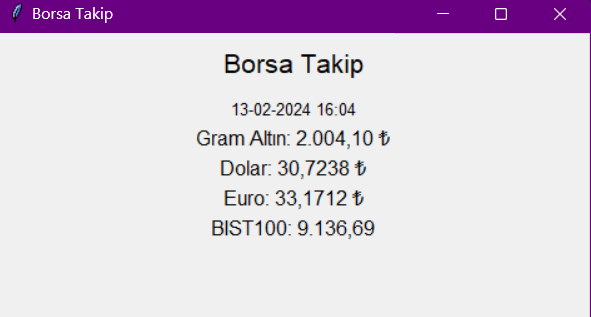

# İnternetten Veri Çekme Pratikleri

Kütüphanelerin Kullanımı
---
* socket: Bu kütüphane, ağ bağlantıları üzerinde düşük seviyeli işlemler yapmayı sağlar. Kod içinde internet bağlantısının durumunu kontrol etmek için kullanılıyor. Örneğin, Google'a bağlanarak internet bağlantısının olup olmadığını kontrol ediyor.

* time: Bu kütüphane, zamanla ilgili işlemleri yapmayı sağlar. Kod içinde zaman bilgisini almak ve belirli aralıklarla işlemleri gerçekleştirmek için kullanılıyor.

* requests: Bu kütüphane, HTTP üzerinden web sayfalarına istek göndermeyi sağlar. Kod içinde belirli bir URL'den web sayfasını çekmek için kullanılıyor.

* BeautifulSoup: Bu kütüphane, HTML ve XML dosyalarını işlemek için kullanılır. Kod içinde web sayfasından veri kazımak için kullanılıyor. Web sayfasının yapısını analiz etmek ve belirli verileri çekmek için kullanılır.

* tkinter: Bu kütüphane, Python'da GUI (Grafiksel Kullanıcı Arayüzü) uygulamaları oluşturmayı sağlar. Kod içinde bir pencere oluşturmak ve GUI bileşenlerini (etiketler, düğmeler vb.) oluşturmak ve düzenlemek için kullanılıyor. Kullanıcı arayüzünü oluşturmak ve güncel verileri göstermek için kullanılıyor.


Projenin Amacı ve Anlamı
---
Borsa ile ilgili bir website üzerinden altın, dolar, euro, bist100 değerlerini 1 dakikada güncellenecek şekilde çekerek kullanıcıya tkinter kütüphanesini kullanarak arayüz ile göstermek.




İlgili verileri çekmek için öncelikle siteye gidip çekmek istediğimiz verinin html kodunu inceledik 
örnek vermek gerekirse altın için 
````
altindata = soup.find("span", {"data-socket-key": "gram-altin"}).text
````
Burada span içindeki data-socket-key değerinin gram-altin'a eşit olan değerini bulup çekiyoruz böylece değeri elde etmiş olduk. 


